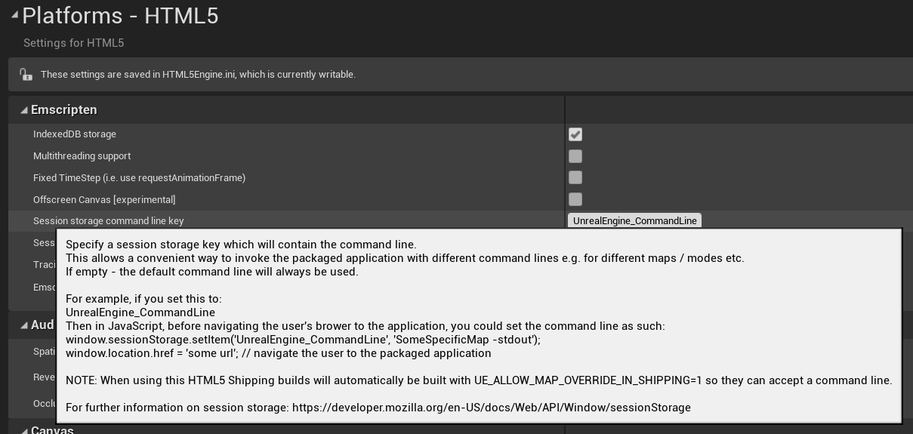

# Command Line

This feature can be enabled by option 'Session storage command line key' in Project Settings -> Platforms -> HTML5:

As shown in the tooltip: This allows you to specify a session storage key which will contain the command line.

This allows a convenient way to invoke the packaged application with different command lines e.g. for different maps / modes etc.

If empty - the default command line will always be used.

For example, if you set this to: `UnrealEngine_CommandLine`

Then in JavaScript, before navigating the user's browser to the application, you could set the command line as such:

    window.sessionStorage.setItem('UnrealEngine_CommandLine', 'FirstPersonExampleMap -stdout');
	window.location.href = 'http://localhost:8000/FirstPerson.html'; // navigate the user to the packaged application

 NOTE: When using this HTML5 Shipping builds will automatically be built with `UE_ALLOW_MAP_OVERRIDE_IN_SHIPPING=1` so they can accept a command line.
     
For further information on session storage: https://developer.mozilla.org/en-US/docs/Web/API/Window/sessionStorage