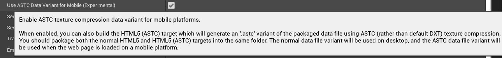
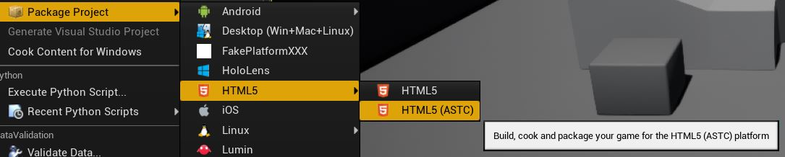

# Improved Mobile Support (Experimental)

## ASTC Texture Compression

HTML5 packaging by default uses [DXT textures](https://en.wikipedia.org/wiki/S3_Texture_Compression) which is not ideal for mobile platforms.

As an experiment, this fork now allows you to package using [ASTC texture compression](https://en.wikipedia.org/wiki/Adaptive_scalable_texture_compression) which can be better for mobile platforms (I have only tested on iPhone though, so more work may be needed - possibly even more texture compression formats).

The way this is done (for now) is that you can produce two different variants of the packaged data, a DXT variant (default - for desktops etc.) and an ASTC variant (for mobiles).

The web page then does a simple check on the useragent and tells mobile devices to use the ASTC data instead of DXT. Default for everything else is DXT as normal.

This requires you to packaged your project **twice** to the **same location**. Once to produce DXT assets and then again to produce ASTC assets.

First, enable ASTC data variant support. If you don't do this, DXT data will be used for all platforms and you will get an error when trying to build for ASTC:

When you package, you should first build **HTML5** and then build **HTML5 (ASTC)** to the **same location** (some files will be overwritten):

By building to the same location, most packaging output is the same and just overwrites, but in the ASTC variant you will get data files with a different name. For example for a project called 'MyProject' the produced data files will be:

- `MyProject.data.gz` - this is the compressed data with DXT textures (default)
- `MyProject.data.js.gz` - this is the loading JS for the DXT data
- `MyProject.astc.data.gz` - this is the compressed data with ASTC textures (for mobile)
- `MyProject.astc.data.js.gz` - this is the loading JS for the ASTC data

All other generated files should function the same in both packaging modes and so it shouldn't matter whether you package DXT or ASTC first. 

Having two separate data variants allows the web page to only download the data it needs for the platform it is running on.

## Touch Support

Only basic touch support has been added. The following events are sent to Unreal as **mouse events**:

- **touchstart** - sent to Unreal as though left mouse button pressed
- **touchmove** - sent to Unreal as though mouse is moving
- **touchend** - sent to Unreal as though left muse button is released

Ideally in the future it would be better to have these sent to Unreal as proper touch input and support multi touch but for now touch just acts like a mouse clicking and dragging.
