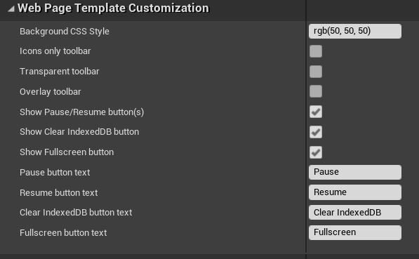
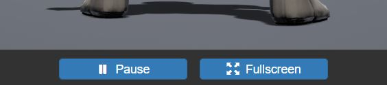
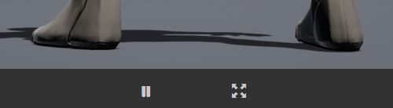
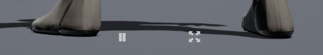

# Web Page Template Customization

Quickly/easily configure the appearance of the generated web page when packaging for HTML5.

Customization includes background color, visibility of each toolbar button, button labels, transparent toolbar, and overlay toolbar (moves the toolbar above the rendered content to avoid wasting screen space).

## Examples

### Default Toolbar

For reference, this is what the toolbar looks like by default:

### Transparent Toolbar without Labels

If you **Icons only toolbar** (hides text on buttons) and **Transparent toolbar** (buttons are transparent):

### Overlay toolbar

**Overlay toolbar** puts the toolbar over the content, which can look nice when using just icons and transparent buttons to limit how much it overlap with rendered content:

