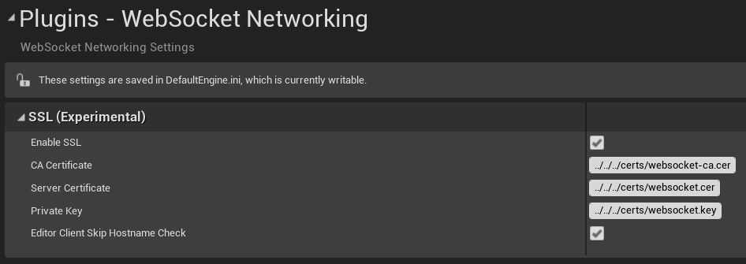
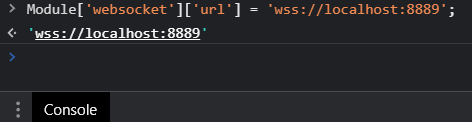
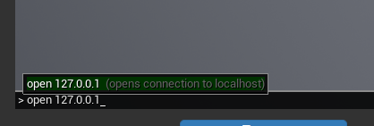
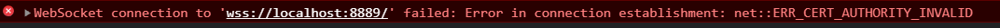
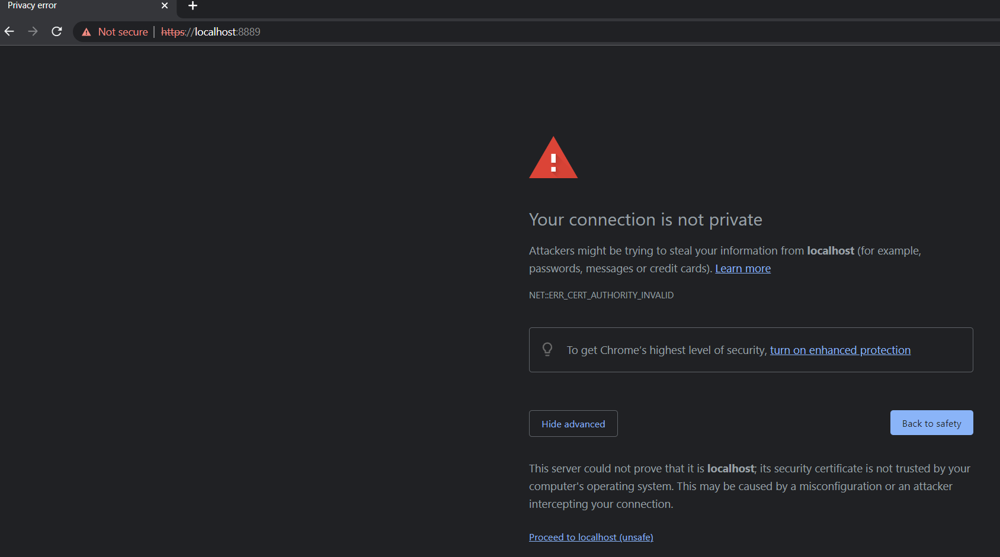

# WebSocket SSL (Experimental)

## Overriding the WebSocket URL

Unreal normally tries to connect to servers via IP rather than hostname. Unfortunately, this causes a problem for SSL websockets as the browser checks SSL certificates against the __hostname__ e.g. `unrealengine.com`. So we need a way to force our HTML5 client to connect to a hostname rather than an IP.

Thus, a feature has been added to allow you to force a websocket connection URL via a session storage key.

You can enable this in 'Session storage WebSocket URL key' in Project Settings -> Platforms -> HTML5:
 

 
As shown in the tooltip, this will allow you to specify a session storage key which will contain a websocket URL to be used in __all__ multiplayer connection attempts (and ignoring whatever IP Unreal was trying to connect to).

If empty - the normal IP address connection behavior will occur.

For example, if you set this to: `UnrealEngine_WebSocketUrl`

Then in JavaScript, before navigating the user's browser to the application, you could set the URL as such:

	 window.sessionStorage.setItem('UnrealEngine_WebSocketUrl', 'wss://localhost:8889');
	 window.location.href = 'http://localhost:8000/FirstPerson.html'; // navigate the user to the packaged application

For further information on session storage: https://developer.mozilla.org/en-US/docs/Web/API/Window/sessionStorage
     

## Enabling WebSocket SSL

Once you have the websocket URL set up correctly, you can enable SSL via "Enable SSL" setting in Project Settings -> Plugins -> WebSocket Networking:

The certs are located relative to the Unreal binary, which for the editor will be UE4Editor.exe in `Engine\Binaries\Win64` so by going three times into parent directory we the engine root folder where you can create a certs folder and include the certs.

The certs must be in PEM format and are as such:
- CA Certificate - the root certificate authority.
- Server Certificate - the public certificate "full chain" for your domain.
- Private Key - your server's public **AND** private key in the same file. Not sure why both are needed here but the SSL library errors if the public key isn't also in here.

When using your own certs and running on your local machine during development, it can be handy to use the *Editor Client Skip Hostname Check* so the Editor will connect OK to a server even if the hostname doesn't match up (e.g. when connecting in Client mode to a local dedicated server etc. during development).

## Generating localhost certs for testing

If you need to generate a localhost CA and certificate you can use something like the following:

    openssl genrsa -out "websocket-ca.key" 4096

    echo -e "\n\n\n\n\nlocalhost-CA\n" | \
	openssl req -out "websocket-ca.cer" -new -nodes -x509 -days 36500 -key "websocket-ca.key"

    echo -e "\n\n\n\n\nlocalhost\n\n\n" | \
	openssl req -out "websocket.csr" -new -newkey rsa:4096 -nodes -keyout "websocket.key" -days 36500

    openssl x509 -in "websocket.csr" -out "websocket.cer" -days 36500 -CA "websocket-ca.cer" -CAkey "websocket-ca.key" -CAcreateserial -req

Now put the relevant files in your engine's `certs` folder, for example.

## Testing in Chrome with localhost testing certs

First, run a server somewhere (e.g. in the editor). It should be listening on 8889 and should be expecting SSL connections.

In Chrome, load up your project and set the websocket URL you wish to connect to (in Web Developer console), in this case localhost:

    Module['websocket']['url'] = 'wss://localhost:8889';

as such:

Now use the Unreal console to open 127.0.0.1 - the IP doesn't matter as we are forcing a websocket URL:

Chrome should spot that the certificate the server isn't signed by a proper certificate authority and give an error like: `WebSocket connection to 'wss://localhost:8889/' failed: Error in connection establishment: net::ERR_CERT_AUTHORITY_INVALID`

The trick to getting around this during local testing is to take the websocket URL e.g. wss://localhost:8889 and swap out the wss: for https: and try going to the URL as such:

When you click Proceed to localhost, Chrome will begin ignoring the problem with your testing certificate and the SSL websocket will be allowed if you try the websocket connection process again in Unreal.

If you have *real* certificates that you want to test locally, it can be handy to temporarily add your domain (or some subdomain if you have a wildcard certificate) to the Windows hosts file and point it to 127.0.0.1 when testing locally. Your browser will then properly trust the local Unreal server without any issues.