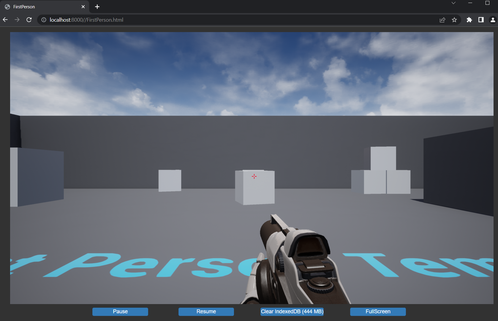

# UnrealEngine HTML5 ES3

This is work which builds upon the Epic Games HTML5 platform plugin to add:
- Support for **ES3 shaders** rather than ES2.
- Support the **latest/final version of UE4 (4.27)**.
- Support for a **recent version of emscripten** (will try to keep this up to date).

Some other changes are also made to try and make a better out of the box experience:

- Build compression of assets (to .gz files) is enabled by default. You can still disable this if you prefer.
- All required scripts/assets (e.g. Bootstrap) are now included in built project (no more third party JS/font downloads).
- Web browser IndexedDB usage is enabled by default to prevent having to download all the assets on each page refresh. You can still turn this off if you prefer it disabled.
- IndexedDB notices/warnings are sent to console rather than a banner to avoid visual clutter.
- Uses HTML5 single-threaded by default as it seems to work a bit better (tried this after seeing @ufna's decision). Multi-threaded still works though and is available if you prefer that.
- Web socket networking and plugin is enabled by default - this is needed to support multiplayer in HTML5.
- Development builds now use optimisation level "O1" rather than O2 (O2 takes a while in latest emscripten so didn't seem so good for quick dev builds). It seems run fast enough to be worth the quick builds in Development mode. Test/Shipping is still O3 as before.

Tested on Windows with Firefox and Chrome based browsers.

## Branches

**NOTE: to access the below repository branches etc. you need to link your Epic Games account to GitHub - see your [Epic Games Account](https://www.epicgames.com/account/connected)**

### [UnrealEngine 4.27-html5-es3](https://github.com/SpeculativeCoder/UnrealEngine/tree/4.27-html5-es3)

This is **UnrealEngine 4.27.2** with HTML5 platform support using **ES3** shaders and **emscripten 3.1.24**.

If you want to take a look at the full code here is a [diff](https://github.com/EpicGames/UnrealEngine/compare/4.27.2-release...SpeculativeCoder:4.27-html5-es3) of this branch against the pristine UE 4.27.2 release.

### [UnrealEngine 4.24-html5-es2](https://github.com/SpeculativeCoder/UnrealEngine/tree/4.24-html5-es2)

This is **UnrealEngine 4.24.3** with HTML5 platform support using **ES2** shaders and **emscripten 3.1.24** 

This may be useful as a fallback if you still need to use 4.24 or ES2 but want the other changes above - it also works as a reference of changes versus @nickshin's Epic Games HTML5 plugin development branch - see this [diff](https://github.com/UnrealEngineHTML5/UnrealEngine/compare/4.24.3-html5-1.39.18...SpeculativeCoder:4.24-html5-es2) for the comparison.

## Commentary

If interested in a more in-depth discussion of the development / code etc. there are some notes in a [COMMENTARY](https://github.com/SpeculativeCoder/UnrealEngine/wiki/COMMENTARY) wiki page which I will aim to add to over time.

## Discussion / Issues

If you need to raise any technical issues / discussions regarding this fork we should prefer to use the [Issues](https://github.com/SpeculativeCoder/UnrealEngine/issues) / [Discussions](https://github.com/SpeculativeCoder/UnrealEngine/discussions) attached to the fork to ensure we are inside the Epic Games account system (just to be safe).

## Guide

### Requirements

- Git (e.g. Git for Windows)
- Visual Studio 2019 (2022 works too)
- CMake
- Python (3.*)

I have only built on Windows. Other platforms may need further fixes/changes

### Installation

Using a shell e.g. Git for Windows BASH shell.

Clone the repository branch:

    git clone -b 4.27-html5-es3 --single-branch https://github.com/SpeculativeCoder/UnrealEngine.git ue-4.27-html5-es3

Go into the folder:

    cd ue-4.27-html5-es3
    
Run:
    
    ./Setup.bat

This will download a lot of dependencies used by Unreal engine and perform some setup tasks. Then do:

    cd Engine/Platforms/HTML5
    ./HTML5Setup.sh

This patches the UnrealEngine source with a bunch of fixes, downloads emscripten SDK and builds the various support libraries (e.g. PhysX). It takes a while.

Now do:

    cd -
    ./GenerateProjectFiles.bat

Open ``UE4.sln`` in Visual Studio.

You first need to add the HTML5LauncherHelper project to the solution... to do this you can Right Click **Programs** then **Add -> Existing Project** then navigate to and select this project to add to the solution: ``Engine\Platforms\HTML5\Source\Programs\HTML5\HTML5LaunchHelper\HTML5LauncherHelper.csproj``

Now you can build all the programs. CTRL-Click the following projects to select them all at once:

- UE4
- AutomationTool
- AutomationToolLauncher
- HTML5LaunchHelper
- ShaderCompileWorker
- UnrealBuildTool
- UnrealFrontend
- UnrealHeaderTool
- UnrealLightmass
- UnrealPak

Now **Right Click -> Build Selection**

This will take a long time. UE4 will end being built last and takes the longest.

### Usage

You can run the editor at ``Engine\Binaries\Win64\UE4Editor.exe``

First time though you will probably have to wait a while for shaders to compile.

Make a new First Person (or whatever you want) project. You should be able to build the project for HTML5 via **Package Project -> HTML5**

Once built, go to to where the build was packaged and run ``HTML5LaunchHelper.exe``

Navigate to http://localhost:8000

You should see the running game.

## Troubleshooting

### When building HTML5 you see: **error CS1519: Invalid token '(' in class, struct, or interface member declaration**

If you see this when trying to build HTML5 then in Visual Studio CTRL-Click these:
- AutomationTool
- AutomationToolLauncher
- HTML5LaunchHelper

Then do **Right Click -> Rebuild Selection** to force rebuild the .NET programs. Seems to fix the issue.

### When running game you see in browser console an error with Assertion failure regarding multisampled textures

Try disabling Mobile MSAA (in Project Rendering options).

### When compiling, you see: "Detected compiler newer than Visual Studio 2019, please update min version checking"

This will happen when using Visual Studio 2022. It is just a warning and shouldn't cause any issues as VS2022 seems to be able to build the engine fine.

## More Information

You can find more information about the original HTML5 platform plugin at the [ GitHub for Epic Games HTML5 platform plugin](https://github.com/UnrealEngineHTML5/Documentation)