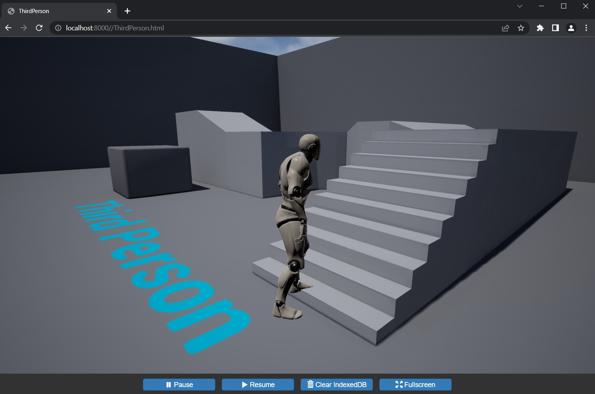

# Unreal Engine 4.27 HTML5 ES3 (WebGL 2) & 4.24 HTML5 ES2 (WebGL 1)

This is documentation for a fork of Unreal Engine 4 which builds upon the last version of the [community-supported HTML5 (WebGL) platform plugin](https://github.com/UnrealEngineHTML5/Documentation) to add:
- Support for the **latest/final version of UE4 (4.27.2)**.
- Support for **ES3 shaders (WebGL 2)**.
- Support for a **more recent version of [emscripten](https://emscripten.org/)** (will try to keep this up to date).
- A number of other features and improvements (see below). 

Also available is an **alternative branch with UE 4.24.3 using ES2 shaders (WebGL 1)** for those who wish to remain on that version.

_NOTE: To access the [fork](https://github.com/SpeculativeCoder/UnrealEngine) and the associated [Issues](https://github.com/SpeculativeCoder/UnrealEngine/issues?q=) and [Discussions](https://github.com/SpeculativeCoder/UnrealEngine/discussions?discussions_q=) sections you need your GitHub linked to your [Epic Games Account](https://www.epicgames.com/account/connected) or you will see [404 errors](https://github.com/UnrealEngineHTML5/Documentation/issues/12#issuecomment-597729773)._

Packaged HTML5 projects work best in Firefox or Chrome-based browsers on Windows 10/11. They also seem to work for now in Firefox, Safari and Chrome-based browsers on MacOS. Mobile is experimental (only tested on iPhone, though).

Development and packaging of HTML5 projects (i.e. building and using this fork of Unreal Editor) is done on Windows 10 (but 11 should also be OK).

Live Example: [**AdhocCombat** (https://adhoccombat.com)](https://adhoccombat.com) - personal project, work in progress

### Other Features / Improvements

- Added [**experimental mobile support**](Features/Feature-MobileSupport.md) with ASTC texture compression and some basic touch input support. You should package to both HTML5 and HTML5 (ASTC) targets to the same location and the web page will automatically try to use ASTC when ran on a mobile device.
- Added [**optional, experimental, support for websocket SSL**](Features/Feature-WebSocketSSL.md), including the ability to connect to a hostname rather than just an IP address. This allows multiplayer to work when serving the HTML5 client via HTTPS.
- Added [**Project Settings -> HTML5 -> Emscripten -> Web Page Template Customization**](Features/Feature-WebPageTemplateCustomization.md) options to allow easier configuration of the packaged HTML5 web page.
- Added an [**optional way to pass command line options to the HTML5 application**](Features/Feature-CommandLine.md) e.g. to easily select different maps and/or modes etc.
- **Build compression of assets (to .gz files) is enabled by default**. If your hosting environment does not set the appropriate `Content-Type: gzip` HTTP header when serving these files, this fork will use the browser's built-in JavaScript [DecompressionStream](https://developer.mozilla.org/en-US/docs/Web/API/DecompressionStream) to get the assets.
- **All required scripts/assets (e.g. Bootstrap) are included in built project** (no more third party JS/font downloads).

There are a number of [CAVEATS](CAVEATS.md) with this fork that you should be aware of. Also see [TROUBLESHOOTING](TROUBLESHOOTING.md) for typical issues / troubleshooting / workarounds.

## Git Repository / Branches

_NOTE: To access the links below you need to link your Epic Games account to GitHub - see your [Epic Games Account](https://www.epicgames.com/account/connected) - if you do not do this you will see [404 errors](https://github.com/UnrealEngineHTML5/Documentation/issues/12#issuecomment-597729773)._

### 4.27 HTML5 ES3 (WebGL 2)

https://github.com/SpeculativeCoder/UnrealEngine/tree/4.27-html5-es3

This is **Unreal Engine 4.27.2** with HTML5 platform support using **ES3 shaders (WebGL 2)** and **emscripten 4.0.3**

It is based on the rolling Epic 4.27-plus branch so the best way to view the changes made by this fork is a [diff against Epic 4.27-plus 
and @nickshin's last community supported UE4.24 HTML5 plugin code](https://github.com/SpeculativeCoder/UnrealEngine/compare/4.27-plus_with_4.24.3-html5-1.39.18_plugin..4.27-html5-es3) (this shows the actual changes made by this fork in the plugin code to get it working with UE4.27). Otherwise if you look at a [diff against just Epic 4.27-plus](https://github.com/EpicGames/UnrealEngine/compare/4.27-plus...SpeculativeCoder:4.27-html5-es3) it will just show the plugin code as new files in the Platforms/HTML5 folder.

### 4.24 HTML5 ES2 (WebGL 1)

https://github.com/SpeculativeCoder/UnrealEngine/tree/4.24-html5-es2

This is **Unreal Engine 4.24.3** with HTML5 platform support using **ES2 shaders (WebGL 1)** and **emscripten 4.0.3**

It is based on the last version of the @nickshin community supported UE4.24 HTML5 plugin. This may be useful as a fallback if you still need to use UE 4.24 and/or ES2 but want the other changes above. If you want to look at the changes see this [diff against @nickshin's last community supported UE4.24 HTML5 plugin code](https://github.com/UnrealEngineHTML5/UnrealEngine/compare/4.24.3-html5-1.39.18..SpeculativeCoder:4.24-html5-es2).

## Requirements

- **Windows 10** (11 should also work)
- **Git for Windows** (this also includes the Git Bash terminal which is used to build this fork)
- **Visual Studio 2019 or 2022**
  - Workload ".NET desktop environment"
  - Workload "Game Development with C++"
  - Individual component "NET Framework 4.6.2 development tools"
  - Individual component latest version of "Windows 11 SDK" that your Visual Studio installer offers. Other SDK's will probably also work OK but I always test with the latest available in the installer.
- **CMake** (make sure you select to add it to PATH during installation or manually after)
- **Python 3.*** (watch out for Windows Python app installer "app execution aliases" which may cause problems - recommend setting these to disabled - see [this Stack Overflow post](https://stackoverflow.com/a/61958044))

I have only built/tested on Windows 10 using the above requirements and the commands below in a Git Bash terminal. Other platforms may need further fixes/changes. See [TEST_REPORT](TEST_REPORT.md) for the last test run I have done including versions of the above requirements at the time of testing.

## Installation

These are the steps I use/consult when installing/testing the plugin. These steps are basically the same as those in the [original documentation for the community-supported plugin](https://github.com/UnrealEngineHTML5/Documentation/blob/master/Platforms/HTML5/HowTo/README.0.building.UE4.Editor.md) which has even more detail so it can sometimes be useful to consult those too if you get stuck.

Use a Git for Windows **Git Bash** shell.

Clone the appropriate repository branch (you can also download the branch as a ZIP and unpack it if you prefer that way).

For the 4.27 ES3 (WebGL 2) branch you can do:

    `git clone -b 4.27-html5-es3 --single-branch https://github.com/SpeculativeCoder/UnrealEngine.git ue-4.27-html5-es3`

Or, alternatively, for the 4.24 ES2 (WebGL 1) branch you would instead do:

    `git clone -b 4.24-html5-es2 --single-branch https://github.com/SpeculativeCoder/UnrealEngine.git ue-4.24-html5-es2`

This should download the branch (it will take a while depending on your connection as the source is quite large).

Back in Git Bash, go into the folder:

    cd ue-4.27-html5-es3
    
Run:
    
    ./Setup.bat

This will download a lot of dependencies used by Unreal engine and perform some setup tasks.

Now do:

    cd Engine/Platforms/HTML5
    ./HTML5Setup.sh

This patches the Unreal Engine source with a bunch of fixes, downloads emscripten SDK and builds the various support libraries (e.g. PhysX). It takes a while. At the end of this some notification sounds will be played to try and let you know it's finished and you should see the line `Success!` after a bunch of green messages. 

*If you do not see the 'Success!' line or you see any other errors then something has gone wrong and any further steps will encounter problems. You should investigate/resolve this issue first before going any further. Tip: issues with the HTML5Setup.sh step can also often leave Engine/Platforms/HTML/Build/emsdk in a broken state so deleting that directory is often a necessary part of trying again after you have chased down whatever the problem was.*

Now do:

    cd -
    ./GenerateProjectFiles.bat

*If you see any errors about `NODEJS NOT FOUND` then please do the fix described in [the NODEJS version issue troubleshooting section](https://github.com/SpeculativeCoder/UnrealEngine-HTML5-ES3/blob/main/TROUBLESHOOTING.md#when-running-generateprojectfilesbat-you-see-node_js-not-found). You should be able to run `./GenerateProjectFiles.bat` after making the fix and no NODEJS errors should occur.*

Open `UE4.sln` in Visual Studio. 

*You may see a popup asking if it is OK to upgrade some .NET programs to 4.8. You can accept this in each case (I typically click the "do this for all" checkbox to get through this quicker).*

Set Solution Configuration to: **Development Editor**

Set Solution Platform to: **Win64**

(the above two options are in the toolbar at the top of the screen usually)

You should now add the HTML5LauncherHelper project to the solution... to do this you can Right Click **Programs** then **Add -> Existing Project** then navigate to and select this project to add to the solution: ``Engine\Platforms\HTML5\Source\Programs\HTML5\HTML5LaunchHelper\HTML5LauncherHelper.csproj``. You may see the .NET 4.8 version upgrade again which you can accept.

Now you can build all the programs. CTRL-Click the following projects to select them all at once:

- UE4
- AutomationTool
- AutomationToolLauncher
- HTML5LaunchHelper
- ShaderCompileWorker
- UnrealBuildTool
- UnrealFrontend
- UnrealHeaderTool
- UnrealLightmass
- UnrealPak

Now **Right Click -> Build Selection**

This will take a long time. UE4 will usually be built last and takes the longest. If you see any failures at the end, try again at least once in case there was any ordering issue etc.

## Usage

You can run the editor at ``Engine\Binaries\Win64\UE4Editor.exe``

First time though you will probably have to wait a while for shaders to compile.

Make a new (e.g. First Person, Third Person, or whatever you want) project. You should be able to build the project for HTML5 via **Package Project -> HTML5**. 

To see the build process / messages, you can show the Output Log via **Window -> Developer Tools -> Output Log**. This is useful for chasing down any problems. 

*If you see a packaging error about AutomationTool failing with messages about "invalid tokens" etc. [you may need to rebuild the .NET programs and try to package again.](https://github.com/SpeculativeCoder/UnrealEngine-HTML5-ES3/blob/main/TROUBLESHOOTING.md#when-packaging-html5-you-see-error-cs1519-invalid-token--in-class-struct-or-interface-member-declaration)*

Once built, go to to where the build was packaged and run ``HTML5LaunchHelper.exe``

Navigate to http://localhost:8000

Select the .html file. You should see your project running in your browser!

## Releasing your Project

**IMPORTANT: Everything is done at your own risk! Also see this documentation's [LICENSE](LICENSE) which includes a disclaimer.**

Here are some things to consider when releasing your project. However, it should not be considered a fully detailed or complete list as this is a huge topic. It is merely intended to be helpful and may be added to over time.

### Legal requirements

Consider the legal requirements of distributing Unreal Engine, content etc. (e.g. users will typically be downloading the packaged engine/project to their machine and running it). You should adhere to all legal requirements. Legal advice is not provided here - it is your responsibility. I am not a lawyer. This is not legal advice.

Some relevant links:
- https://www.unrealengine.com/en-US/release
- https://www.unrealengine.com/en-US/eula/unreal
- https://www.unrealengine.com/en-US/eula/content

### Crypto

Since all packaged data is given to the user in the download (i.e. both encrypted data _and_ the the code/information to decode it), **you must assume all encryption keys and packaged data can always be obtained/cracked by the user**. However, using this functionality could help to further signal the _intent_ on your part to associate the executable code and content more closely together. You would have to come up with your own approach if you wanted anything more than this.

**Project Settings -> Crypto**

Click **Generate Project Key** to generate a key (use different keys for each platform you package for as some platforms may be easier/harder to crack).

You can enable all four:
- **Encrypt PAK Ini Files** = true
- **Encrypt PAK Index** = true
- **Encrypt UAsset Files** = true
- **Encrypt All Asset Files** = true

### Ensure only needed maps are packaged

By default, Unreal includes all assets used by _any_ map in the project. So if you have enabled starter content (which is typical), or some Marketplace assets, these may have maps in them that are dragging in a lot of assets you didn't actually intend to use.

You should set the maps which will be included the packaging via this setting (make sure it has only the maps you make use of): **Project Settings -> Packaging -> List of maps to include in packaged build**

This is an advanced setting so you may need to click the down arrow to show it.

### Set appropriate texture sizes

See community plugin documentation entry: https://github.com/UnrealEngineHTML5/Documentation/blob/master/Platforms/HTML5/HowTo/README.2.advanced.UE4.HTML5.md#smash-texture-sizes

### IndexedDB on or off

**Project Settings -> Platforms -> HTML5 -> Emscripten -> IndexedDB storage**

IndexedDB storage is disabled by default.

If you enable IndexedDB support, the downloaded data files will be "cached" in the user's IndexedDB, which is a database managed by the user's browser. When the user visits your site again, the data will instead be obtained from their IndexedDB. This can be particularly useful for projects that the user will regularly visit/use.

However, if you feel your project will only be visited as a one-off, or you are happy for the download to be done every time, you can keep IndexedDB support disabled and the user's browser will not be asked to cache the data.

### Asset compression on or off

There are two compression mechanisms in place right now:
- **PAK file compression** (**Project Settings -> Project -> Packaging -> Packaging -> Create compressed cooked packages**) (you can see this by clicking the down arrow as it is an advanced setting). **This should always be left enabled** and dramatically reduces the size of your data PAK (which will include all the cooked content for the project).
- **Asset compression** (**Project Settings -> Platforms -> HTML5 -> Packaging -> Compress files during packaging**). This helps reduce the size of _all_ the files in your packaged project. Asset compression's most useful contribution is that it significantly reduces the size of the WASM file (this is the compiled engine / project code). However, it does not actually reduce the PAK file much further (which is _already_ itself compressed via PAK file compression).

### Customizing the controls / web page

HTML5 projects use a set of template files in `Engine/Platforms/HTML5/Build/TemplateFiles` to produce the packaged project HTML/JS/CSS etc. This is what defines the appearance of the buttons at the bottom of the screen, for instance. You may wish to customize these files, either by editing them in the engine folder (not ideal as it is easy to lose the changes when a new version of this fork is released etc.) or by creating a copy of them in your project's `Build/HTML5` folder which will then be picked up during the HTML5 packaging process.

## Fork Updates / Fresh Start

If a new version of the fork is released (i.e. a new commit to the branch), it is best to do a clean build to avoid any issues.

If you downloaded as ZIP, just delete the old extracted directory, download the branch again and start from scratch.

If you cloned the git repository / branch, go into the existing folder where you cloned the git repository e.g.

    cd ue-4.27-html5-es3
    
Then do:

     rm -fr Engine/Platforms/HTML5/Build/emsdk/emsdk-* && git clean -fdx && git -c core.hooksPath=/dev/null restore .

This will clear everything out to almost exactly as you originally downloaded (the hooksPath argument stops the Unreal git hooks from downloading any new files).

Now do

    git -c core.hooksPath=/dev/null pull
    
This will bring in the latest version of the branch.

Now follow the original [Installation](#Installation) guide starting with `./Setup.bat` step and so on.

## Issues / Discussions

If you need to raise any technical issues / discussions regarding this fork and the code changes you can use the [Issues](https://github.com/SpeculativeCoder/UnrealEngine/issues?q=) or [Discussions](https://github.com/SpeculativeCoder/UnrealEngine/discussions?discussions_q=) sections for the fork (for these sections you need your GitHub linked to your [Epic Games Account](https://www.epicgames.com/account/connected) or you will see [404 errors](https://github.com/UnrealEngineHTML5/Documentation/issues/12#issuecomment-597729773)).

Also there could be some general HTML5 plugin discussion in Unreal Slackers Discord https://unrealslackers.org/ in the **#web** channel (but note this channel is for general discussion of Unreal on the web, including the <a href="https://docs.unrealengine.com/5.1/en-US/pixel-streaming-in-unreal-engine/">Pixel Streaming</a> technology).

If interested in a more technical commentary of the development / code etc. (could be useful if you are also working on the HTML5 plugin) there are some notes in the wiki under [COMMENTARY](https://github.com/SpeculativeCoder/UnrealEngine/wiki/COMMENTARY) which I will aim to add to over time (you need your GitHub linked to your Epic Games account to see this or you will see 404 error).

## Documentation Copyright / License

Copyright (c) 2022-2025 SpeculativeCoder (https://github.com/SpeculativeCoder)

 This work is licensed under a <a rel="license" href="http://creativecommons.org/licenses/by/4.0/">Creative Commons Attribution 4.0 International License</a>.

See [LICENSE](LICENSE) (CC-BY-4.0). The license only applies to the files in this repository.

**IMPORTANT: Any other repositories that are referred to / linked to are under their own copyright / license. For example https://github.com/SpeculativeCoder/UnrealEngine is under the Unreal Engine EULA etc. which you accept when you link your GitHub account to your Epic Games account.**
