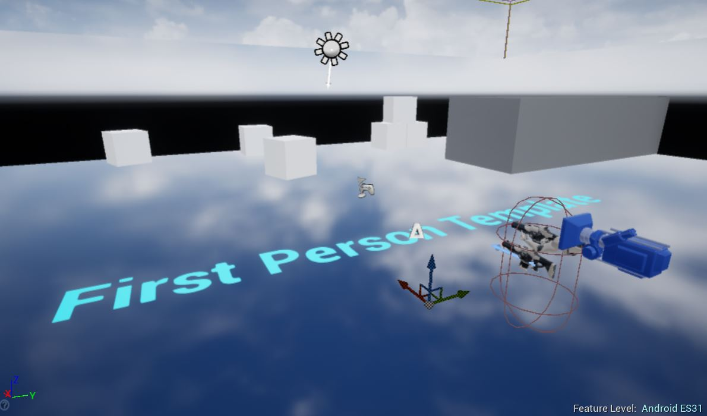
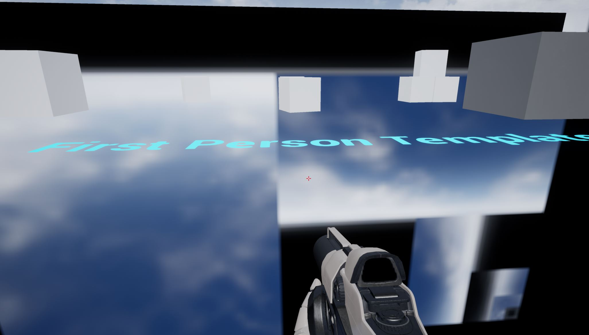
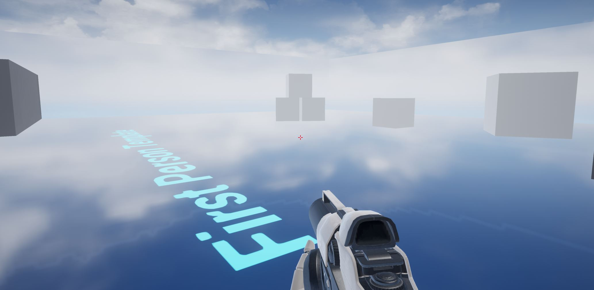

# Unreal Engine 4.27 HTML5 ES3 (WebGL 2) & Unreal Engine 4.24 HTML5 ES2 (WebGL 1)

## Troubleshooting

These are issues you may run into using the latest version of the fork.

### When running HTML5Setup.sh you see: `zlib-1.2.8.tar.gz: Cannot open: No such file or directory`

This happens if you run HTML5Setup.sh without first having run the ./Setup.bat stage. Running ./Setup.bat to ensure all the dependencies Unreal needs are downloaded (including this zlib tar) should avoid this error.

After resolving this issue, you should ensure to delete the `Engine/Platforms/HTML/Build/emsdk` folder before trying HTML5Setup.sh again as emsdk can sometimes be left in a broken state.

### When running HMTL5Setup.sh you see: `Python` (and/or things simply stop after seeing "Resolving deltas: 100% (XXX/XXX), done." and nothing more happens), or possibly other errors relating to Python

Even if you have official Python properly installed, Windows may have some [app installer "app execution aliases" for Python](https://stackoverflow.com/a/61958044) that could possibly be interfering with Python usage.

After resolving this issue, you should ensure to delete the `Engine/Platforms/HTML/Build/emsdk` folder before trying HTML5Setup.sh again as emsdk can sometimes be left in a broken state.

### When running GenerateProjectFiles.bat you see: `NODE_JS NOT FOUND`

This may look like the following:

```
$ ./GenerateProjectFiles.bat
Setting up Unreal Engine 4 project files...
ERROR: NODEJS NOT FOUND: ... \ue-4.24-html5-es2\Engine\Platforms\HTML5\Build\emsdk\emsdk-3.1.60\node\16.20.0_64bit\bin\node.exe
*** NODE_JS NOT FOUND: error_nodejs_not_found
*** NODE_JS NOT FOUND: error_nodejs_not_found
Binding IntelliSense data... 100%
Writing project files... 100%
```

The `ERROR: NODE_JS NOT FOUND` is a problem and needs to to be fixed before proceeding.

Sometimes the version of node used by emscripten changes. I try to keep this up to date for each release of this fork. However if this change happens at any time you can manually bump the expected version of node rather than waiting for the next release of this fork.

Look in directory `Engine/Platforms/HTML5/Build/emsdk/emsdk-3.1.60/node` (the emscripten version i.e.  3.1.60 may be different - just look in the folder of whatever latest version of emscripten is being used).

You will then see a directory with the version of node that actually needs to be used e.g. `18.20.3_64bit`

Now look at the file `Engine/Platforms/HTML5/Source/Programs/UnrealBuildTool/HTML5SDKInfo.cs`

You should see a line defining `NODE_VER` e.g. it would be set to `16.20.0_64bit` for the above error.

Change it to the correct version e.g. `18.20.3_64bit` for our example.

Now run `./GenerateProjectFiles.bat` again and you should not see the error:

```
$ ./GenerateProjectFiles.bat
Setting up Unreal Engine 4 project files...
Binding IntelliSense data... 100%
Writing project files... 100%
```

You can carry on with the next stage of setup i.e. opening UE4.sln in Visual Studio.

### When opening UE4.sln in Visual Studio you see **Target framework not supported** popup for each .NET program

For each of these you should be able to accept the default of **Update the target** to the newer version of .NET which seems to work fine.

### When compiling AutomationTool or you have issues relating to AutomationTool not being built correctly (typically something going wrong with HoloLens Automation DLLs), or see an error about .NET 4.6.2 reference assemblies not being available, or similar.

Make sure you the Individual component "NET Framework 4.6.2 development tools" installed in your Visual Studio installation and try again.

### When compiling, you see: `C1083	Cannot open include file` relating to `dte80a.tlh` and/or `VisualStudioDTE`

I noticed this when compiling the ES2 branch occasionally and it may or may not happen on ES3 branch also (unsure). It seems to be a transient error.

Simply resuming the same build again (i.e. Right Click -> Build) should work and complete the build.

### When running game you see in browser console an error with: `Assertion failed` regarding multisampled textures

Try disabling Mobile MSAA as such:

**Project Settings -> Rendering -> Mobile -> Mobile MSAA** - set this to **No MSAA**

Repackage your project and you should not see the same error this time.

### When running game you see in browser console an error with: `Assertion failed` relating to a compression method and `file needs to be forced to use zlib compression`

This can happen if you have both the **Project Settings -> Packaging -> Pak File Compression Format(s)** set to **Oodle** (this is the default in UE4.27) and **Project Settings -> Packaging -> Use this Compression Format not hardware override** enabled (this is _not_ the default so could be a problem if your project had it enabled).

NOTE: These are advanced settings so you need to click the down arrow to unhide the settings.

The HTML5 platform currently needs the PAK files using **Zlib** compression so is relying on a "hardware override" to Zlib.

You should disable **Use this Compression Format not hardware override** to ensure the "hardware override" for HTML5 (Zlib) gets picked up.

Alternatively, as a final resort, you can just set **Project Settings -> Packaging -> Pak File Compression Format(s)** to **Zlib** 

Once you have done either of the above you can package the project again as HTML5 and see if the issue is fixed. You may need to to clear the IndexedDB and/or browser cache so you get the newly generated PAK file.

### When running game you see that Skylight Cubemap reflections are incorrect

If you have reflections and are relying the Skylight Cubemap (whether scene capture or specific cubemap), it will look OK the editor preview:



But when ran in the browser you will see an incorrect rendering:



Until this issue can be fixed, you will need to use other sources of a reflection cubemap in your level such as a SphereReflectionCapture (both scene capture or specific cubemap should work OK with this):



[Original report thread with discussion](https://github.com/SpeculativeCoder/UnrealEngine/issues/148) (NOTE: this link requires your GitHub account to be linked to Epic Games account or you will see 404). Thanks to [@wadim-al](https://github.com/wadim-al) for reporting this issue.

## Troubleshooting - Legacy

These are issues that existed in older versions of the fork which you should hopefully be able to avoid by using the latest version.

### When packaging HTML5 you see: `error CS1519: Invalid token '(' in class, struct, or interface member declaration`

_Note: This may have been fixed in upstream as of [this commit](https://github.com/SpeculativeCoder/UnrealEngine/commit/4a04c0552d6fcdd3d667b37ee9dbbb9e84e562bc) - update to the latest version of the fork to hopefully avoid this issue_ 

If you see this when trying to package for HTML5 then in Visual Studio CTRL-Click these:
- AutomationTool
- AutomationToolLauncher
- HTML5LaunchHelper
- UnrealBuildTool

Then do **Right Click -> Rebuild Selection** to force rebuild the .NET programs. Seems to fix the issue (try packaging again and you shouldn't see the error).

### When compiling, you see: `Detected compiler newer than Visual Studio XXXX, please update min version checking`

_Note: Should be fixed as of [this commit](https://github.com/SpeculativeCoder/UnrealEngine/commit/66aee96af0c6e7a6c3bcb78d27a16760b9239744) - update to the latest version of the fork avoid this issue_ 

XXXX is just whatever version of Visual Studio the branch was last successfully tested with. This can appear if you are using an even more recent version of Visual Studio e.g. 2022 latest releases. It is just a warning and shouldn't cause any issues as VS2022 seems to be able to build the engine fine.

### When running `Setup.bat` you see a `403` `Forbidden` error or similar

_Note: Should be fixed as of [this commit](https://github.com/SpeculativeCoder/UnrealEngine/commit/20b9c4c6eb68fbb1105a1d4541d6ff9f9b1d339a) - update to the latest version of the fork avoid this issue_

There was a problem with old crypto/TLS versions. To resolve this [flags were added](https://github.com/SpeculativeCoder/UnrealEngine/commit/20b9c4c6eb68fbb1105a1d4541d6ff9f9b1d339a#diff-de7b562e658c9e7ce9bc7f7c588ee923d14d5ef6360807dc9b994aeffea88a27) to GitDependencies.exe.config to allow it to use newer crypto/TLS. This should help avoid download problems during Setup.bat step. See https://learn.microsoft.com/en-us/dotnet/framework/network-programming/tls for more info on these flags.

Also, much older versions of the fork (prior to [this commit](https://github.com/SpeculativeCoder/UnrealEngine/commit/3e7742c5300a07e2122ffd4c1bbebfa6cde97f7d)) did not have a fix Epic put out for the Commit.gitdeps.xml file. Either use the latest version of the fork or, per per an [announcement from Epic Games](https://forums.unrealengine.com/t/upcoming-disruption-of-service-impacting-unreal-engine-users-on-github/1155880), you will need to replace the `Commit.gitdeps.xml` in the `Engine/Build` folder with a version newly provided by Epic depending on the engine version you are using. You can download the latest Commit.gitdeps.xml from the *Assets* section of the relevant Unreal Engine release below and replace the file in your `Engine/Build` folder with it:
- https://github.com/EpicGames/UnrealEngine/releases/tag/4.27.2-release if you are using 4.27 ES3 (WebGL 2) branch
- https://github.com/EpicGames/UnrealEngine/releases/tag/4.24.3-release if you are using 4.24 ES2 (WebGL 1) branch

### When compiling, you see: some error involving `NOEXCEPT` and preprocessor macros

_Note: Should be fixed as of [this commit](https://github.com/SpeculativeCoder/UnrealEngine/commit/3e7742c5300a07e2122ffd4c1bbebfa6cde97f7d) - update to the latest version of the fork avoid this issue_ 

This fork now supports the latest version of Windows SDK (now the Windows 11 SDK). However prior to the above commit, this fork would need to be built with the last version of the Windows 10 SDK or you would see the `NOEXCEPT` error. If you are using an older version of the fork you can ensure you only have the latest version of the Windows 10 SDK. You can check in Visual Studio Installer (and possibly also Add/Remove Programs in your Windows) to see which Windows SDK's are installed. After ensuring only the latest Windows 10 SDK is being used you can try rebuilding the fork.

### When running the game you only see a blank white page with buttons at the top and/or in the console log you see: `Uncaught SyntaxError: illegal character U+001F` and/or you see error/warning message: `Downloaded a compressed file XXX without the necessary HTTP response header "Content-Encoding: gzip"`

_Note: A workaround for the gzip header missing was added as of [this commit](https://github.com/SpeculativeCoder/UnrealEngine/commit/bb4fd48050d006df946f20e014d730a40a894cd7) which should now work in latest Firefox, Chrome-based and Safari browsers so hopefully this issue won't happen any more. It is still best to avoid the risk though by ensuring the header as described below._ 

If you are using compressed packaging for HTML5 (which is the default), you need to ensure the files ending in `.gz' (i.e. the compressed files) are served with the following HTTP header:

    Content-Encoding: gzip
    
This signals to the web browser that it needs to decompress the file before trying to use it.

The way the header can be set depends on how you are hosting the files. It will differ per solution - check the documentation for your web hosting solution. 

However, if you need to temporarily work around this, you can disable compressed packaging:

Project Settings -> HTML5 -> Packaging -> Compress files during packaging: Set to **false**

Most of the increase in size due to turning off this compression will be in the size of the Unreal binary code which will no longer be compressed. The PAK data file actually has its own compression (which should be turned on by default) handled by Unreal so depending on how big your project the increase may or may not be a significant versus the overall size. 

Also some web hosting solutions may _automatically_ do all the gzip compression of .css / .js assets on the fly (and set appropriate headers too) so in those cases you may be better off not using compressed packaging.

### When running the game with the ES3 branch you notice that stationary directional light is not casting dynamic shadows

_Note: Should be fixed as of [this commit](https://github.com/SpeculativeCoder/UnrealEngine/commit/a6f50bc17c27756ce0f37e76628d982926c81158) - update to the latest version of the fork avoid this issue_ 

In the ES3 version of the fork, **modulated** dynamic shadows (e.g. casted by moving meshes) from a stationary directional light do not appear:


In the ES2 version of the fork, modulated dynamic shadows do appear: 


The cause of this issue is currently unknown, but as a workaround for stationary direction lights you could switch to normal dynamic shadows (i.e. do not use modulated shadows).

On your directional light, set **Cast Modulated Shadows** to **false** (you may need to click the down arrow in Light section to see this as it is an advanced property).

You will also need to be sure you have set an appropriate distance in the **Dynamic Shadow Distance** in the Cascaded Shadows Maps section of the directional light (default is 0 which will disable the shadow). For example, with a setting of 500, in the third person sample project the non-modulated dynamic shadow looks as follows:


You will likely need to tweak the Cascaded Shadow Map settings etc. to get an acceptable quality / performance balance for your project.

### When compiling you see a compile error about discarding a return value in `SteamVRInputDeviceFunctionLibrary.cpp`

_Note: Should be fixed as of [this commit](https://github.com/SpeculativeCoder/UnrealEngine/commit/ae86634b7667197cb36a4b6232eabc94d0b6d2f1) - update to the latest version of the fork avoid this issue_ 

This was an error which has appeared in the newer Visual Studio which appears to have stricter checking. See this [issue](https://github.com/SpeculativeCoder/UnrealEngine/issues/45) for more detail and a fix if you are using an older version of the fork and need a quick fix (NOTE: this link requires your GitHub account to be linked to Epic Games account or you will see 404).

### When running HTML5Setup.sh you see: `fatal: not a git repository (or any of the parent directories): .git`

_Note: Should be fixed as of [this commit](https://github.com/SpeculativeCoder/UnrealEngine/commit/3552c51f1a81aeb94f4bf1de5a347986bd5e3ca1) - update to the latest version of the fork avoid this issue_ 

The HTML5Setup.sh script used to do a git checkout/restore to ensure the engine files were in a clean state before applying a patch, hence it didn't work if you downloaded a ZIP. However, I changed the HTML5Setup.sh to no longer require a git repository so if you have an older version of the code just do a new clone or ZIP download and you shouldn't run into this problem any more.

### When packaging HTML5 you see: `WARNING: Library XXX as not resolvable to a file when used in Module 'XXX'`

_Note: Should be fixed as of [this commit](https://github.com/SpeculativeCoder/UnrealEngine/commit/3552c51f1a81aeb94f4bf1de5a347986bd5e3ca1) - update to the latest version of the fork avoid this issue_ 

The XXX is usually PhysX. This seems to occur when HTML5Setup.sh randomly fails to properly build PhysX (or some other third party library) with an error like ```mingw32-make.exe[2]: write error: stdout``` but doesn't actually stop the ./HTML5Setup.sh build so it is easy to miss and you will only notice when then trying to package for HTML5.

If you get this issue try running ./HTMLSetup.sh again.

NOTE: In the latest versions of the above branches the third party libraries are built using only a single thread (-j 1) to hopefully avoid this problem happening as much.

### When running the game with the ES3 branch you see a blue tint / incorrect reflections

_Note: Should be fixed as of [this commit](https://github.com/SpeculativeCoder/UnrealEngine/commit/3c9050caa5d0faf0bc161f63367c95751f3a4351) - update to the latest version of the fork avoid this issue_ 

In older versions of the ES3 fork you may notice incorrect colors on the reflections, which may or may not appear as a blue tint as shown in this screenshot:


One workaround was to pick a gray texture (e.g. GrayTextureCube) for your sphere reflection spheres (rather than using scene captures):


However, this has been fixed in the latest version of the fork, so you should update to receive the fix and reflections should look more correct:


[Original report thread with discussion / resolution](https://github.com/SpeculativeCoder/UnrealEngine/issues/19) (NOTE: this link requires your GitHub account to be linked to Epic Games account or you will see 404). Thanks to [@MackeyK24](https://github.com/MackeyK24) for reporting this issue.
