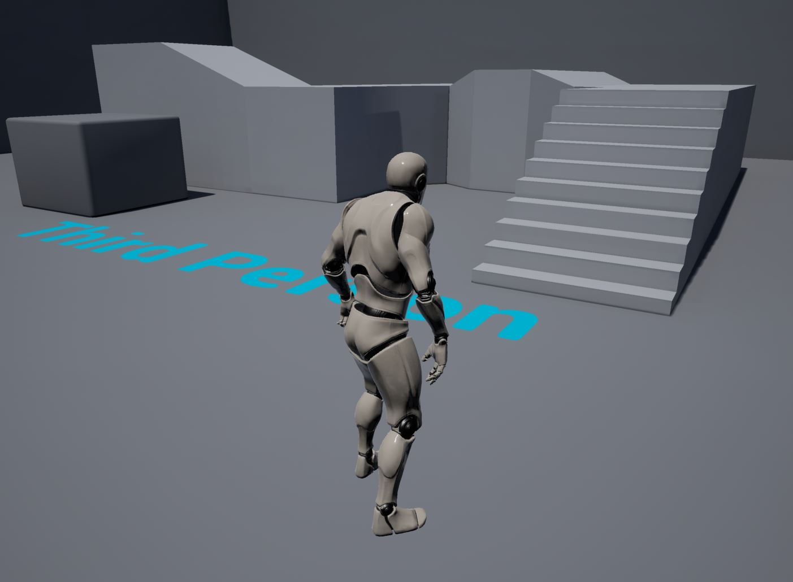
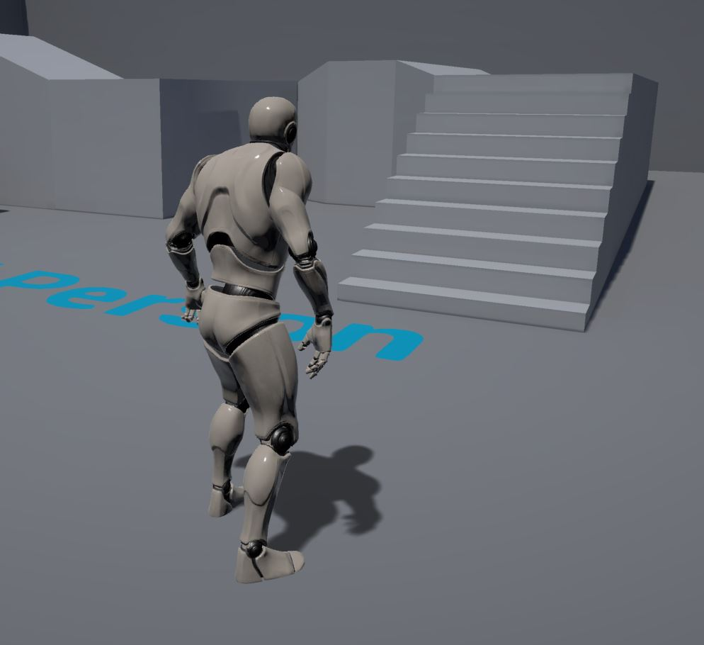
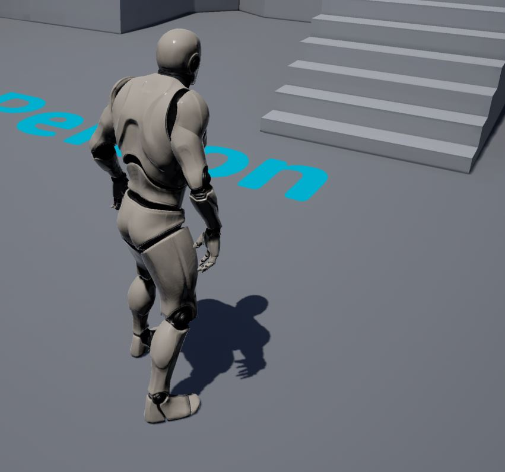
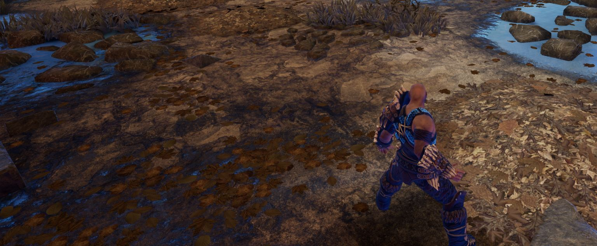
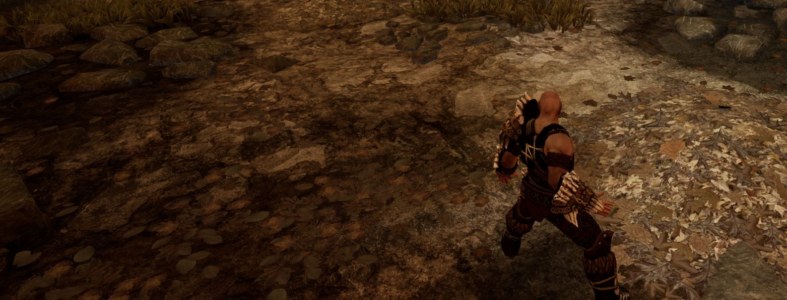
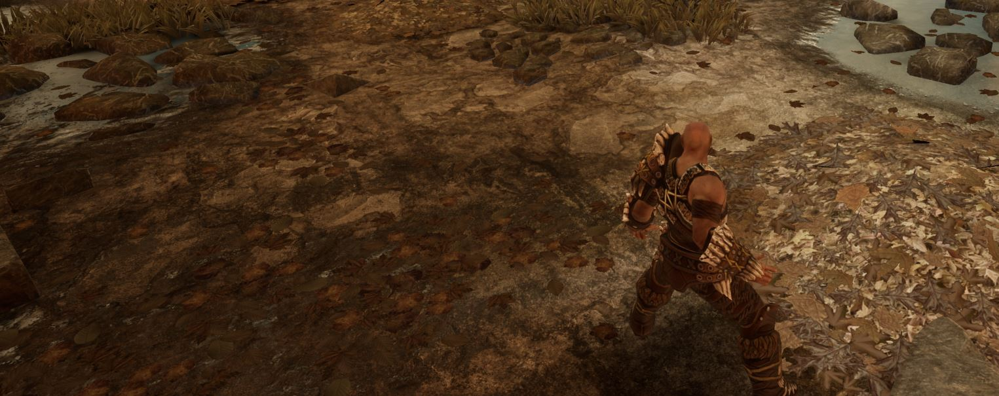

# Unreal Engine 4.27 HTML5 ES3 (WebGL 2) / Unreal Engine 4.24 HTML5 ES2 (WebGL 1)

## Troubleshooting

These are issues you may run into using the latest version of the fork.

### When running HTML5Setup.sh you see: "zlib-1.2.8.tar.gz: Cannot open: No such file or directory"

This happens if you run HTML5Setup.sh without first having run the ./Setup.bat stage. Running ./Setup.bat to ensure all the dependencies Unreal needs are downloaded (including this zlib tar) should avoid this error.

After resolving this issue, you should ensure to delete the `Engine/Platforms/HTML/Build/emsdk` folder before trying HTML5Setup.sh again as emsdk can sometimes be left in a broken state.

### When running HMTL5Setup.sh you see: "Python" (and/or things simply stop after seeing "Resolving deltas: 100% (XXX/XXX), done." and nothing more happens), or possibly other errors relating to Python

Even if you have official Python properly installed, Windows may have some [app installer "app execution aliases" for Python](https://stackoverflow.com/a/61958044) that could possibly be interfering with Python usage.

After resolving this issue, you should ensure to delete the `Engine/Platforms/HTML/Build/emsdk` folder before trying HTML5Setup.sh again as emsdk can sometimes be left in a broken state.

### When opening UE4.sln in Visual Studio you see "Target framework not supported" for each .NET program

For each of these you should be able to accept the default of "Update the target" to the newer version of .NET which seems to work fine.

### When compiling, you see: "Detected compiler newer than Visual Studio XXXX, please update min version checking"

XXX is just whatever version of Visual Studio the branch was last successfully tested with. This can appear if you are using an even more recent version of Visual Studio e.g. 2022 latest releases. It is just a warning and shouldn't cause any issues as VS2022 seems to be able to build the engine fine. I will keep trying to bump the version check to avoid the warning but new releases of VS2022 may trigger it again.

### When packaging HTML5 you see: **error CS1519: Invalid token '(' in class, struct, or interface member declaration**

If you see this when trying to package for HTML5 then in Visual Studio CTRL-Click these:
- AutomationTool
- AutomationToolLauncher
- HTML5LaunchHelper
- UnrealBuildTool

Then do **Right Click -> Rebuild Selection** to force rebuild the .NET programs. Seems to fix the issue (try packaging again and you shouldn't see the error).

### When running game you see in browser console an error with: "Assertion failed" regarding multisampled textures

Try disabling Mobile MSAA as such:

**Project Settings -> Rendering -> Mobile -> Mobile MSAA** - set this to **No MSAA**

Repackage your project and you should not see the same error this time.

### When running the game you only see a blank white page with buttons at the top and/or in the console log you see: "Uncaught SyntaxError: illegal character U+001F" and/or you see error/warning message: "Downloaded a compressed file XXX without the necessary HTTP response header "Content-Encoding: gzip""

If you are using compressed packaging for HTML5 (which is the default), you need to ensure the files ending in `.gz' (i.e. the compressed files) are served with the following HTTP header:

    Content-Encoding: gzip
    
This signals to the web browser that it needs to decompress the file before trying to use it.

The way the header can be set depends on how you are hosting the files. It will differ per solution - check the documentation for your web hosting solution. 

However, if you need to temporarily work around this, you can disable compressed packaging:

Project Settings -> HTML5 -> Packaging -> Compress files during packaging: Set to **false**

Most of the increase in size due to turning off this compression will be in the size of the Unreal binary code which will no longer be compressed. The PAK data file actually has its own compression (which should be turned on by default) handled by Unreal so depending on how big your project the increase may or may not be a significant versus the overall size. 

Also some web hosting solutions may _automatically_ do all the gzip compression of .css / .js assets on the fly (and set appropriate headers too) so in those cases you may be better off not using compressed packaging.

_Note: A partial attempt to workaround the gzip header missing was added as of [this commit](https://github.com/SpeculativeCoder/UnrealEngine/commit/bb4fd48050d006df946f20e014d730a40a894cd7) but it only applies to Chrome-based and Safari browsers (so NOT Firefox) and may not always work so it is probably best to set the header or just turn off the 'Compress files during packaging' setting._ 

## Troubleshooting - Legacy

These are issues that existed in older versions of the fork which you should hopefully be able to avoid by using the latest version.

### When running the game with the ES3 branch you notice that stationary directional light is not casting dynamic shadows

_Note: Should be fixed as of [TODO this commit](https://github.com/SpeculativeCoder/UnrealEngine/commit/ae86634b7667197cb36a4b6232eabc94d0b6d2f1) - update to the latest version of the fork avoid this issue_ 

In the ES3 version of the fork, **modulated** dynamic shadows (e.g. casted by moving meshes) from a stationary directional light do not appear:



In the ES2 version of the fork, modulated dynamic shadows do appear: 



The cause of this issue is currently unknown, but as a workaround for stationary direction lights you could switch to normal dynamic shadows (i.e. do not use modulated shadows).

On your directional light, set **Cast Modulated Shadows** to **false** (you may need to click the down arrow in Light section to see this as it is an advanced property).

You will also need to be sure you have set an appropriate distance in the **Dynamic Shadow Distance** in the Cascaded Shadows Maps section of the directional light (default is 0 which will disable the shadow). For example, with a setting of 500, in the third person sample project the non-modulated dynamic shadow looks as follows:



You will likely need to tweak the Cascaded Shadow Map settings etc. to get an acceptable quality / performance balance for your project.

### When running game you see in browser console an error with: "Assertion failed" relating to a compression method and "file needs to be forced to use zlib compression"

This can happen if you have PAK file compression format set to **Oodle**. This HTML5 plugin requires you to use **Zlib** compression. You can change this as follows:

Project Settings -> Packaging -> Pak File Compression Format(s): Change this from **Oodle** to **Zlib** 

NOTE: This is an advanced setting so you need to click the down arrow to unhide the setting.

Once you have done this you can package the project again as HTML5 and see if the issue is fixed. You may need to to clear the IndexedDB and/or browser cache so you get the newly generated PAK file.

### When compiling you see a compile error about discarding a return value in `SteamVRInputDeviceFunctionLibrary.cpp`

_Note: Should be fixed as of [this commit](https://github.com/SpeculativeCoder/UnrealEngine/commit/ae86634b7667197cb36a4b6232eabc94d0b6d2f1) - update to the latest version of the fork avoid this issue_ 

This was an error which has appeared in the newer Visual Studio which appears to have stricter checking. See this [issue](https://github.com/SpeculativeCoder/UnrealEngine/issues/45) for more detail and a fix if you are using an older version of the fork and need a quick fix (NOTE: this link requires your GitHub account to be linked to Epic Games account or you will see 404).

### When running HTML5Setup.sh you see: "fatal: not a git repository (or any of the parent directories): .git"

_Note: Should be fixed as of [this commit](https://github.com/SpeculativeCoder/UnrealEngine/commit/3552c51f1a81aeb94f4bf1de5a347986bd5e3ca1) - update to the latest version of the fork avoid this issue_ 

The HTML5Setup.sh script used to do a git checkout/restore to ensure the engine files were in a clean state before applying a patch, hence it didn't work if you downloaded a ZIP. However, I changed the HTML5Setup.sh to no longer require a git repository so if you have an older version of the code just do a new clone or ZIP download and you shouldn't run into this problem any more.

### When packaging HTML5 you see: "WARNING: Library XXX as not resolvable to a file when used in Module 'XXX'"

_Note: Should be fixed as of [this commit](https://github.com/SpeculativeCoder/UnrealEngine/commit/3552c51f1a81aeb94f4bf1de5a347986bd5e3ca1) - update to the latest version of the fork avoid this issue_ 

The XXX is usually PhysX. This seems to occur when HTML5Setup.sh randomly fails to properly build PhysX (or some other third party library) with an error like ```mingw32-make.exe[2]: write error: stdout``` but doesn't actually stop the ./HTML5Setup.sh build so it is easy to miss and you will only notice when then trying to package for HTML5.

If you get this issue try running ./HTMLSetup.sh again.

NOTE: In the latest versions of the above branches the third party libraries are built using only a single thread (-j 1) to hopefully avoid this problem happening as much.

### When running the game with the ES3 branch you see a blue tint / incorrect reflections

_Note: Should be fixed as of [this commit](https://github.com/SpeculativeCoder/UnrealEngine/commit/3c9050caa5d0faf0bc161f63367c95751f3a4351) - update to the latest version of the fork avoid this issue_ 

In older versions of the ES3 fork you may notice incorrect colors on the reflections, which may or may not appear as a blue tint as shown in this screenshot:



One workaround was to pick a gray texture (e.g. GrayTextureCube) for your sphere reflection spheres (rather than using scene captures):



However, this has been fixed in the latest version of the fork, so you should update to receive the fix and reflections should look more correct:



[Original report thread with discussion / resolution](https://github.com/SpeculativeCoder/UnrealEngine/issues/19) (NOTE: this link requires your GitHub account to be linked to Epic Games account or you will see 404). Thanks to [@MackeyK24](https://github.com/MackeyK24) for reporting this issue.
